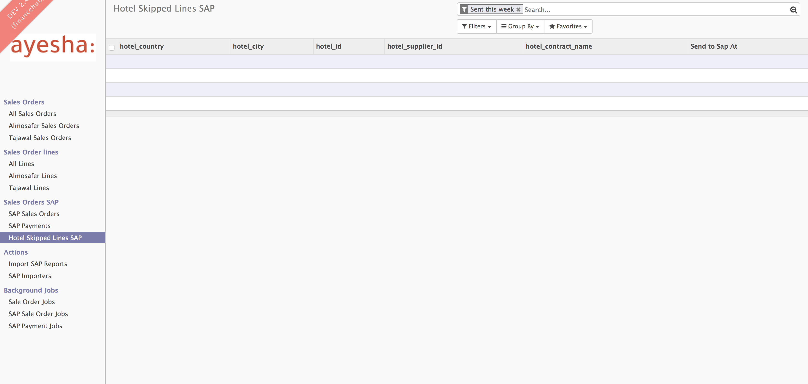

Changes
-------
2.6.20 (2019-10-16)
------------------
- Fixes Imports and Increased Timeouts

2.6.19 (2019-09-30)
------------------
- Revert - Reducing Memory

2.6.18 (2019-09-30)
------------------
- Reducing Memory

2.6.17 (2019-09-29)
------------------
- Correction - Skip Unify Orders and PRs

2.6.16 (2019-09-28)
------------------
- Skip Unify Orders and PRs

2.6.15 (2019-09-08)
------------------
- Ayesha - Skipped Issue Mark Order as NA

2.6.14 (2019-09-07)
------------------
- Revert - Quick fix in PR must block function

2.6.11 (2019-09-06)
------------------
- Quick fix in PR must block function

2.6.10 (2019-09-03)
------------------
- Requirement.txt change

2.6.7 (2019-09-03)
------------------
- Hotel Pay Later Billing Date

2.6.6 (2019-08-01)
------------------
- Payment Status
- Sales Order View - Missing Actions.

2.6.4 (2019-07-30)
------------------
- Supplier Name in Sales Order View.
- Skipped view missing field added.

2.6.3 (2019-07-30)
------------------
- Mark payment request as not applicable.

2.6.2 (2019-07-25)
-------------------
- Update master data - New Airline code (GDS booking).

2.6.1 (2019-07-25)
-------------------
- Auto send Hotel Sale order to SAP.
- Fix Skipped view for Hotels and Payments.

2.6.0 (2019-07-14)
-------------------
- Fix ZVD1 calculation for Hotel Payment Requests.
- Auto send Flight Sale order to SAP.

2.5.0 (2019-07-14)
-------------------
- Handle GDS matched with TF case.
- Add Customer related details to the order header.
- Improve Hotel skipped view and add Payment skipped view.

2.4.12 (2019-07-10)
-------------------
- Undo not applicable for sending.
- Add entity in supplier invoices.
- Allow user to match refund PR with a charge payment request.
- Add paid at in Sale list view.
- Add total invoice in Sale Order and Sale Order line.
- Add Flag when payment amount is different than Sale amount.
- Fix order type filter in SAP Order.

2.4.10 (2019-07-07)
-------------------
- Optimise SAP status and integration status in sale order and payment request.
- Add Sale sent not payment, and payment not sale.

- Add Special view for skippe hotel orders.

- Manual SAP ZVD1 and Manual SAP ZVD1 currency

2.4.8 (2019-07-04)
------------------
- Fix is sent?, is Payment Sent? filter on sale order.
- Fix sending PRs without charges (only sale part will go to SAP.)
- fix payment request SAP record.
- Tune some infra parameters.

2.4.0 (2019-07-02)
------------------
- Block Unpaid Paylater Hotels from being sent.
- send hotel PRs from Ayesha.
- Query optimisation (Add auto join flag for Many2one fields).
- Fix lines with ZSEL = 0.

2.3.8 (2019-07-01)
------------------
- Force Send payment request order and payment to SAP.
- Fix ZSEL amount for refund PRs with discount.
- Fix paylater filters.

2.3.7 (2019-06-30)
------------------
- Double hoop Sale Order.
- Missing domestic UAE Flag.

2.3.4 (2019-06-25)
------------------
* SAP XML for hotels booking.
* Fix IATA Code for airline 275.
* Is voided booking filter.
* AMD vendor code for TF lines matched with GDS lines.
* Hotel/Flight filter for payment request.
* Avoid matching Flight invoice line with Hotel booking.
* Number of Passengers (Guests) for hotels.

2.3.3 (2019-06-18)
------------------
* Fix SAP-XML-API bugs.
* Add missing fields for Hotel.
* Add Manual ZVD1 for hotel Payment request.
* Fix APG IATA Code.

2.3.0 (2019-06-15)
------------------
* SAP SAP/Integration Statuses for Sale/Payment Request.
* Missing fields for hotels.
* SAP Exporter bug fixes.

2.2.8 (2019-06-12)
------------------
* SAP-XML-API wrong Office ID for GDS invoice lines.
* Is Egypt Flag for payment.

2.2.5 (2019-06-12)
------------------
* SAP-XML-API integration fix.

2.2.0 (2019-06-12)
------------------
* SAP-XML-API Integration for flight Intial Bookings and Payment Request.
* Hotel matching and reconciliation.
* Missing fields on Payment and Hotels.

2.1.15 (2019-05-22)
-------------------
* Allow users to mass edit tajwal ID in supplier invoice lines.

2.1.14(2019-05-19)
------------------
* Allow users to select invoices by date and supplier to rerun the mathcing.

2.1.12(2019-05-19)
------------------
* Mass Edit using background jobs.

2.1.9 (2019-05-15)
------------------
* Fix Order/Payment Request reconciliation statuses.

2.1.8 (2019-05-14)
------------------
* Fix reconciliation tag for sale order.
* Add reconciliation tag for payment request.

2.1.7 (2019-05-13)
------------------
* Fix sale order line name for TF and GDS without tickets.
* Fix sending payment request to SAP.
* Display matching and reconciliation statuses for invoice lines in Sale and
Payment request objects.

2.1.5 (2019-05-13)
------------------
* Constraint on Invoice Lines Dates.

2.1.4 (2019-05-08)
------------------
* Revert migration script.

2.1.3 (2019-05-08)
------------------
* Fix reconciliation statuses in sale order.

2.1.2 (2019-05-07)
------------------
* Fix Estimated cost in supplier currency calculation in Payment Request.
* Reconciliation Filter for Order Lines and pivot view.

2.1.1 (2019-05-07)
------------------
* Reconciliation Tag for unreconciled entries.

2.1.0 (2019-05-07)
------------------
* Report Generator for GDS daily report.

2.0.7 (2019-05-07)
------------------
* Add cron job for GDS daily report.

2.0.6 (2019-05-06)
------------------
* Queue Jobs menus.

2.0.5 (2019-05-06)
------------------
* Bug fixes.

2.0.2 (2019-05-05)
------------------
* Remove readonly from sale order sync date.

2.0.1 (2019-05-05)
------------------
* OMS-FINANCE-API URL for live server.

2.0.0 (2019-05-05)
------------------
* Flight booking MVP Matching and Reconciliation for all suppliers.

1.5.6 (2019-04-24)
------------------
* Revert Transaction Type computation. Handeled in SAP-WEB-XML.

1.5.3 (2019-04-08)
------------------
* Do not send SPAN Payment request.

1.5.2 (2019-03-26)
------------------
* Manual OUTPUT VAT amount.

1.5.1 (2019-03-25)
------------------
* Empty GDSCode for change fee lineitem
* Change fee material for live sap.

1.5.0 (2019-03-13)
------------------
* VAT on change fee.
* Fix Payment Transaction calculation.

1.4.5 (2019-02-24)
------------------
* AYESHA-41: Use update_at date when sending to SAP.

1.4.4 (2019-02-14)
------------------
* GDS lines with zero amount should not be sent to SAP

1.4.3 (2019-02-14)
------------------
* AYES-38: Compute tax code using output vat

1.4.2 (2019-02-11)
------------------
* Allow users to import exchange rates.

1.4.1 (2019-02-10)
------------------
* Fix SAP Sale payload and zvt1 proration.

1.4.0 (2019-02-05)
-----------------
* AYESHA-18: Automatically download SAP Sale report from S3 bucket.
* AYESHA-75: Payment Request reconciliation and matching optimisation.
* AYESHA-79: Send payment request line wise when is possible.
* AYESHA-47: For Egypt payment request ZVD1 is equal to ZSEL.
* AYESHA-63: Add Transaction type to payment when sending to SAP.

1.3.6 (2019-01-23)
------------------
* [REF]ofh_payment_request_sap: Send the currency when sending payment to SAP.
